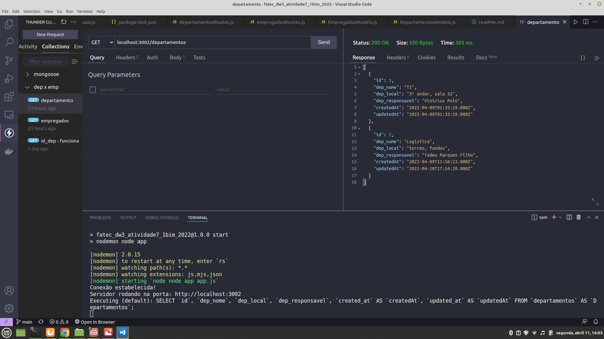
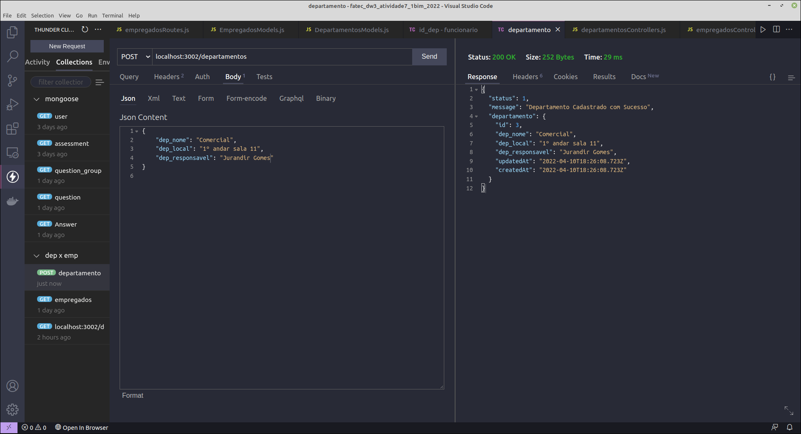
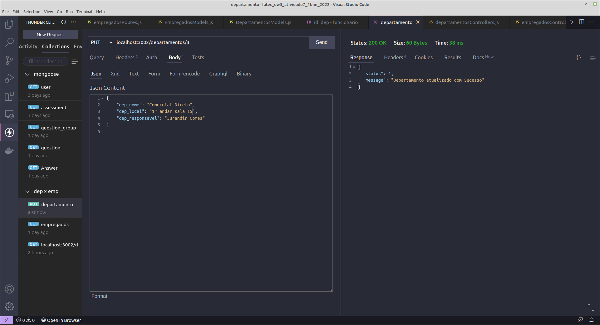
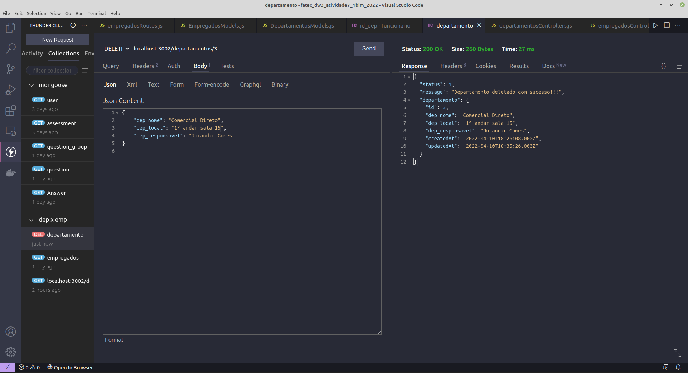
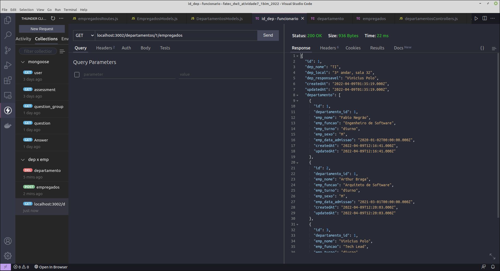
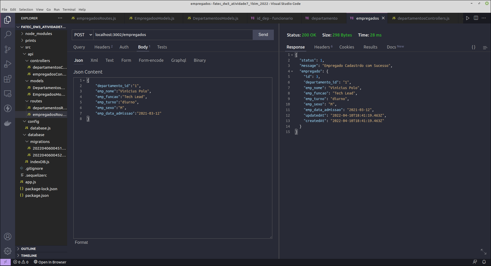

# CRUD Departamentos x Empregados
### Atividade de bimestre de Desenvolvimento Web III

#### Ferramentas utilizadas 
* Node
* Sequelize
* Banco MySQL

##Exemplos da funcionalidade
* Consulta Departamentos

* Criar Departamentos

* Editar Departamentos

* Deletar Departamentos

* Colleciton Departamento e seus Funcionaŕios

* Criar empregados

* Editar empregados

* Deletar empregados

